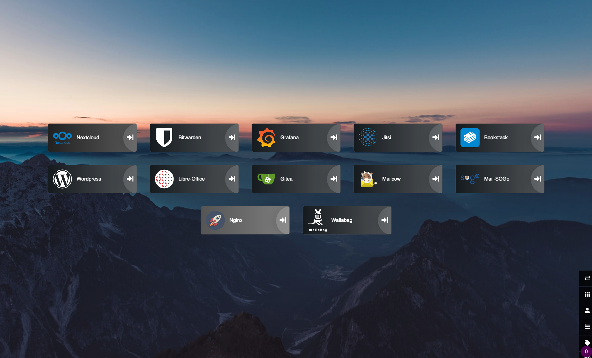
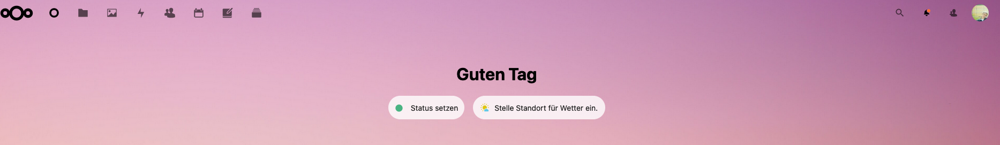
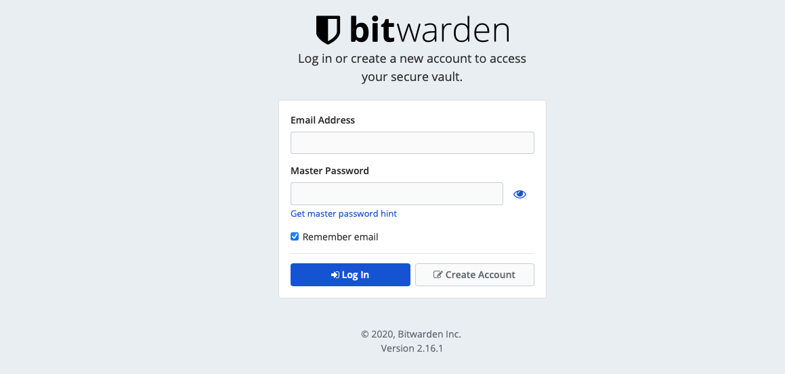
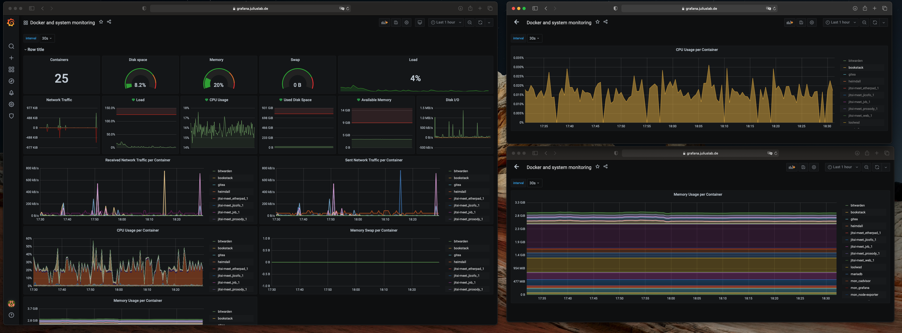
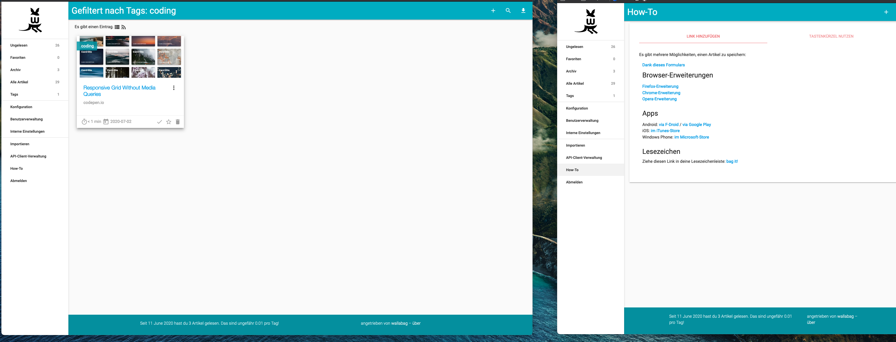

# Docker-Files
Docker-Files behind Traefik-Proxy(https://traefik.io)

Software i used in Docker-Container:
- Nextcloud 
- Wordpress 
- Bitwarden 
- Gitea
- Mailcow(Sogo)
- Grafana(Monitoring) 
- Jitsi-Meet
- Heimdall 
- Bookstack
- Mumble 
- Traefik-Proxy

